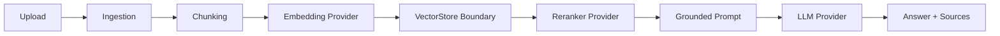

# Personal Knowledge RAG Assistant

[](https://github.com/yangmingzhou-restart/personal-knowledge-rag-assistant/actions/workflows/ci.yml)

## What This Project Does

A local FastAPI-based RAG assistant that uploads text-like files, extracts text, splits content into traceable chunks, stores metadata and embeddings, retrieves relevant chunks through a replaceable VectorStore boundary, reranks candidate chunks and generates grounded answers with source information.

## Current Pipeline

```text
upload -> ingestion -> chunking -> embedding -> vector store -> rerank -> grounded prompt -> LLM answer
```



## Current Features

- Upload `.txt`, `.md`, and `.csv` files.
- Split uploaded text into chunks with `chunk_index`, `start_char`, and `end_char`.
- Store documents, chunks, and embedding JSON in SQLite.
- Use fake embedding and LLM providers for tests and GitHub Actions CI.
- Use local BGE embeddings for local demo retrieval.
- Retrieve top-k chunks by cosine similarity.
- Use a local Ollama LLM provider to generate grounded answers.
- Return `answer`, `provider`, `sources`, and `confidence_notes` from `/answer`.
- Centralize runtime configuration through `.env` and `BaseSettings`.
- Use a replaceable `VectorStore` boundary with SQLite as the default local implementation.
- Keep Qdrant as an optional vector store implementation for local experiments.
- Rerank retrieved candidates before returning final top-k matches.
- Evaluate retrieval quality with anchor-based metrics such as Hit Rate@K, Recall@K, and MRR.
- Provide admin endpoints for manually loading or unloading local embedding, reranker, and Ollama models.

## Tech Stack

- Python
- FastAPI
- SQLite
- pytest
- sentence-transformers
- local BGE embedding model
- Ollama
- GitHub Actions
- Qdrant client
- cross-encoder reranker
- provider-based architecture

## API Endpoints

1. `GET /health`
2. `POST /upload`
3. `POST /retrieve`
4. `POST /answer`
5. `POST /admin/models/embedding/load`
6. `POST /admin/models/reranker/load`
7. `POST /admin/models/ollama/load`

Admin model endpoints use `status=1` to load a model and `status=0` to unload it.

## Local Demo Stack

- API: FastAPI
- Metadata and chunk storage: SQLite
- Default vector store: SQLite-backed local vector storage
- Optional vector store: Qdrant behind the same `VectorStore` boundary
- Embedding model: `BAAI/bge-small-zh-v1.5`
- Reranker model: `BAAI/bge-reranker-base` 
- LLM provider: Ollama
- LLM model: `qwen2.5:3b`

## Configuration

Copy `.env.example` to `.env` and adjust local paths.

```env
EMBEDDING_PROVIDER=local
LOCAL_EMBEDDING_MODEL=D:\models\embedding-models\BAAI\bge-small-zh-v1.5

RERANKER_PROVIDER=cross_encoder
RERANKER_MODEL=D:\models\rerank-model\BAAI\bge-reranker-base

VECTOR_STORE_PROVIDER=sqlite
QDRANT_URL=http://127.0.0.1:6333
QDRANT_COLLECTION=personal_knowledge_chunks

LLM_PROVIDER=ollama
OLLAMA_BASE_URL=http://127.0.0.1:11434
OLLAMA_MODEL=qwen2.5:3b
```

GitHub Actions CI should use fake providers and must not depend on local model files or a running Ollama service: `EMBEDDING_PROVIDER=fake`, `RERANKER_PROVIDER=keyword`, `LLM_PROVIDER=fake`, `VECTOR_STORE_PROVIDER=sqlite`.

## Current Limitations

- The default local demo still uses SQLite-backed vector storage; Qdrant is available as a replaceable implementation but is not the default production backend.
- Retrieval evaluation is intentionally small and anchor-based; it is useful for comparing changes, not a comprehensive benchmark.
- Real embedding, reranker, and Ollama models can exceed laptop VRAM if loaded together, so local demos may require manual model loading/unloading.
- PDF and Word parsing are not fully implemented.
- The project is single-user and does not include authentication, authorization, or user-level data isolation.
- The project is not a production-grade RAG platform; it is a local portfolio project focused on RAG architecture, provider boundaries, evaluation, and demoability.

## Evaluation

The project includes an anchor-based retrieval evaluation set under `eval/`.

The latest local evaluation can run through the reranker stage and report:

- Hit Rate@K
- Recall@K
- MRR
- pass / partial / fail cases

This makes retrieval quality comparable across changes such as reranking, metadata filters, and vector store implementations.

See:

- `eval/evaluation-questions.md`
- `eval/evaluation-results-real-reranker.md`
- `eval/run_retrieval_evaluation.py`

## Planned Improvements

- Improve document parsing for PDF and Word files.
- Add authentication and user-level document isolation.
