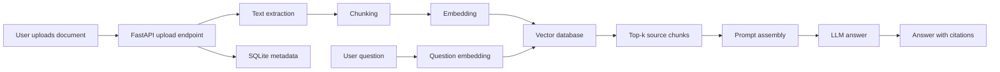

# Personal Knowledge RAG Assistant Spec

## Purpose

Build a practical RAG application that lets users upload private documents and ask questions grounded in those documents.

This project is designed for AI Application Developer / RAG Engineer interviews. It should prove that you can build a complete LLM application workflow, not just call a chatbot API.

## User Story

As a user, I can upload documents and ask questions. The system answers using the uploaded content and shows which source chunks were used.

## Core Features

1. Upload `.txt`, `.md`, `.pdf`, and `.csv` files.
2. Extract plain text from uploaded files.
3. Split text into chunks of 500-800 Chinese/English characters.
4. Store document metadata in SQLite.
5. Store embeddings in a vector database.
6. Retrieve top 5 relevant chunks for a question.
7. Generate an answer with source citations.
8. Return a JSON response containing `answer`, `sources`, and `confidence_notes`.

## Non-Goals

- Do not build user login in the first version.
- Do not build multi-tenant permission management in the first version.
- Do not build a complex frontend before the API works.
- Do not attempt fine-tuning.
- Do not claim enterprise production readiness.

## Architecture



## API Endpoints

### GET `/health`

Purpose:
- Confirm the API service is running.

Output:

```json
{
  "status": "ok"
}
```

### POST `/documents`

Purpose:
- Upload and index one document.

Input:
- multipart file upload

Output:

```json
{
  "document_id": "doc_001",
  "filename": "example.pdf",
  "status": "indexed",
  "chunk_count": 18
}
```

Validation:
- Reject unsupported extensions.
- Reject empty files.
- Return a clear error message if text extraction fails.

### POST `/retrieve`

Purpose:
- Inspect retrieval quality before answer generation.

Input:

```json
{
  "question": "What are the main conclusions?",
  "top_k": 5
}
```

Output:

```json
{
  "question": "What are the main conclusions?",
  "chunks": [
    {
      "document_id": "doc_001",
      "filename": "example.pdf",
      "chunk_id": "chunk_004",
      "score": 0.83,
      "text_preview": "The key result is..."
    }
  ]
}
```

### POST `/questions`

Purpose:
- Ask a question and receive an answer grounded in retrieved document chunks.

Input:

```json
{
  "question": "What are the main conclusions?",
  "top_k": 5
}
```

Output:

```json
{
  "answer": "The document concludes that...",
  "sources": [
    {
      "document_id": "doc_001",
      "filename": "example.pdf",
      "chunk_id": "chunk_004",
      "text_preview": "The key result is..."
    }
  ],
  "confidence_notes": "The answer is grounded in 3 retrieved chunks."
}
```

## Data Model

### `documents`

Fields:
- `document_id`: stable document id.
- `filename`: uploaded filename.
- `extension`: file extension.
- `size_bytes`: uploaded file size.
- `created_at`: ingestion time.
- `status`: `uploaded`, `indexed`, or `failed`.
- `error_message`: extraction/indexing error if any.

### `chunks`

Fields:
- `chunk_id`: stable chunk id.
- `document_id`: parent document id.
- `chunk_index`: integer position in the document.
- `text`: chunk content.
- `created_at`: chunk creation time.

## Chunking Rules

Default:
- Chunk size: 700 characters.
- Overlap: 80 characters.

Rules:
- Preserve paragraph boundaries when possible.
- Fall back to character-based chunking for messy text.
- Skip whitespace-only chunks.
- Keep chunk ids deterministic: `doc_001_chunk_0001`.

## Embedding Rules

Development mode:
- Use fake deterministic embeddings for tests.

Demo mode:
- Use OpenAI-compatible embedding API or a local embedding model.

Principle:
- Keep embedding provider behind a small interface so the project can switch providers.

## Prompt Template

```text
You are a document question-answering assistant.
Answer only from the provided context.
If the context does not contain the answer, say that the uploaded documents do not provide enough evidence.
Always cite the source chunk ids used.

Question:
{question}

Context:
{retrieved_chunks}
```

## Evaluation Plan

Create a folder `examples/` containing:
- 2 sample documents.
- 10 test questions.
- Expected source chunks.
- anchor-based retrieval evaluation with expected evidence labels

Evaluation table:

| Question | Expected Source | Retrieved Source | Pass | Notes |
|---|---|---|---|---|
| What is the main conclusion? | chunk_004 | chunk_004 | yes | Direct match |

## Resume Claims Supported

- Built a FastAPI-based RAG system.
- Implemented document ingestion, chunking, vector retrieval, and cited answer generation.
- Designed retrieval inspection endpoint to debug RAG quality.
- Added SQLite metadata storage for document and chunk tracking.
- Created evaluation examples for retrieval quality.

## Interview Talking Points

- Why RAG reduces hallucination compared with direct prompting.
- How chunk size affects retrieval quality.
- Why source citations matter for enterprise adoption.
- Why retrieval inspection is useful before answer generation.
- Why provider abstraction matters for switching model APIs.
